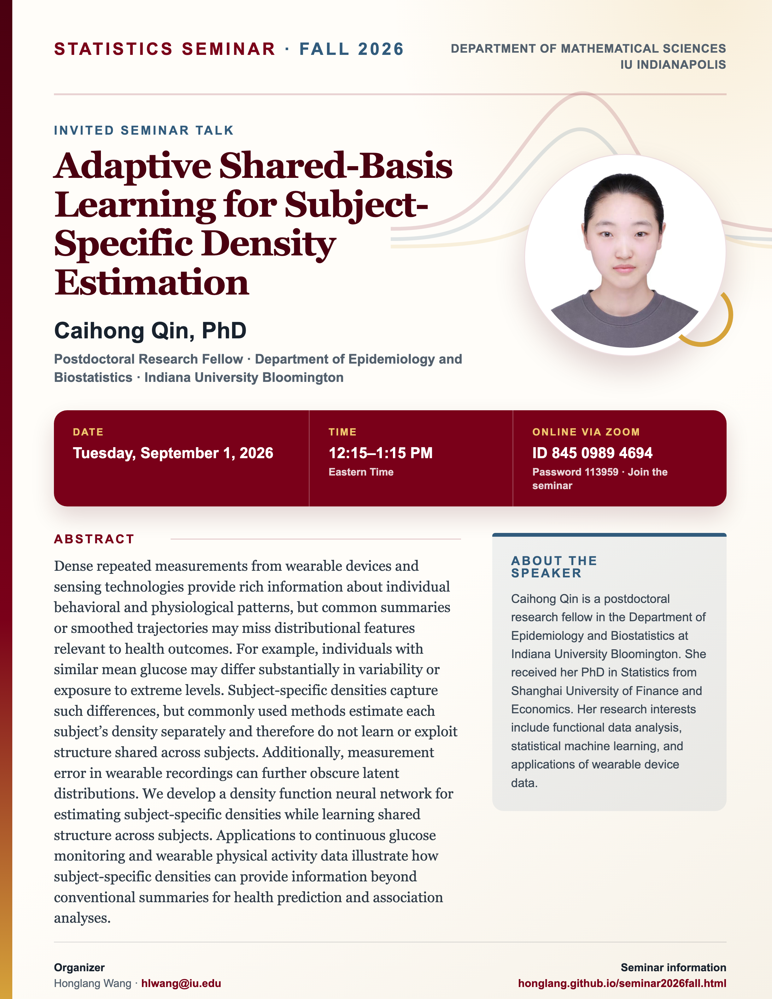

## Statistics Seminar: Fall 2026

**Speaker**: Caihong Qin, Postdoctoral Research Fellow, Department of Epidemiology and Biostatistics, Indiana University Bloomington

**Talk time**: Tuesday, September 1, 2026, 12:15–1:15 PM Eastern Time

**Online via Zoom**: Join from a computer or mobile device using [Zoom](https://iu.zoom.us/j/84509894694?pwd=K1F1c3JickhKREgwd3luellRVVpSUT09), or use Meeting ID **845 0989 4694** with Password **113959**.

## Abstract

Dense repeated measurements from wearable devices and sensing technologies provide rich information about individual behavioral and physiological patterns, but common summaries or smoothed trajectories may miss distributional features relevant to health outcomes. For example, individuals with similar mean glucose may differ substantially in variability or exposure to extreme levels. Subject-specific densities capture such differences, but commonly used methods estimate each subject’s density separately and therefore do not learn or exploit structure shared across subjects. Additionally, measurement error in wearable recordings can further obscure latent distributions. We develop a density function neural network for estimating subject-specific densities while learning shared structure across subjects. Applications to continuous glucose monitoring and wearable physical activity data illustrate how subject-specific densities can provide information beyond conventional summaries for health prediction and association analyses.

## About the Speaker

Caihong Qin is a postdoctoral research fellow in the Department of Epidemiology and Biostatistics at Indiana University Bloomington. She received her PhD in Statistics from Shanghai University of Finance and Economics. Her research interests include functional data analysis, statistical machine learning, and applications of wearable device data.

[View the seminar flyer and full event page](/seminars/CaihongQin/index.qmd).

<!--Include social share buttons-->


