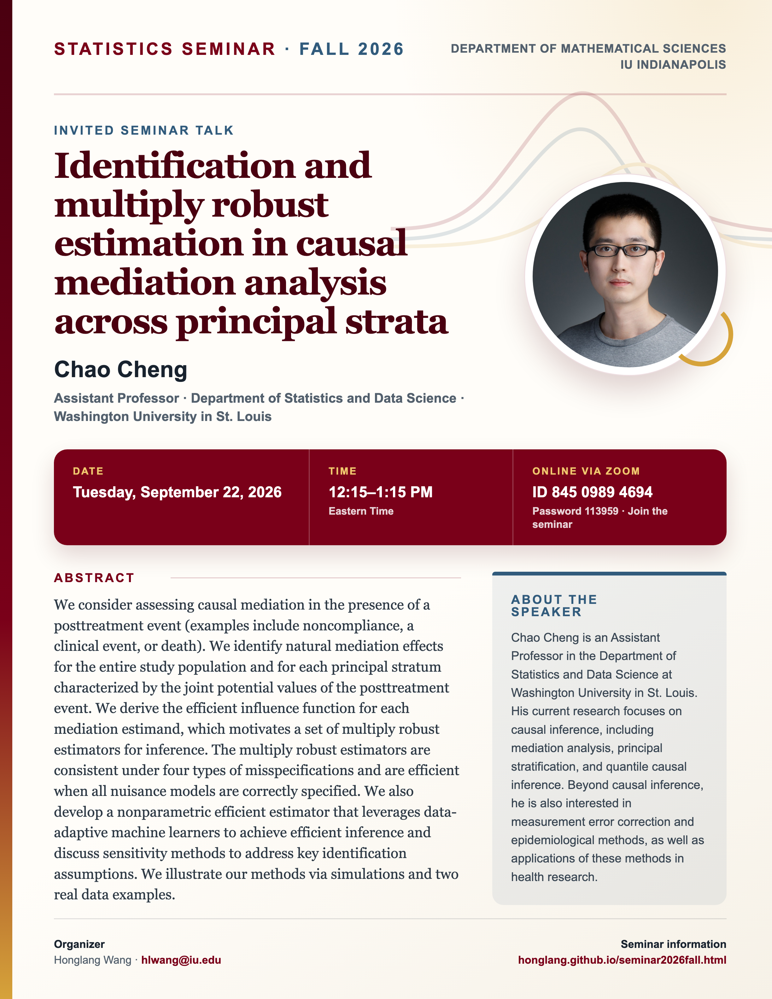

## Statistics Seminar: Fall 2026

**Speaker**: Chao Cheng, Assistant Professor, Department of Statistics and Data Science, Washington University in St. Louis

**Talk time**: Tuesday, September 22, 2026, 12:15–1:15 PM Eastern Time

**Online via Zoom**: Join from a computer or mobile device using [Zoom](https://iu.zoom.us/j/84509894694?pwd=K1F1c3JickhKREgwd3luellRVVpSUT09), or use Meeting ID **845 0989 4694** with Password **113959**.

## Abstract

We consider assessing causal mediation in the presence of a posttreatment event (examples include noncompliance, a clinical event, or death). We identify natural mediation effects for the entire study population and for each principal stratum characterized by the joint potential values of the posttreatment event. We derive the efficient influence function for each mediation estimand, which motivates a set of multiply robust estimators for inference. The multiply robust estimators are consistent under four types of misspecifications and are efficient when all nuisance models are correctly specified. We also develop a nonparametric efficient estimator that leverages data-adaptive machine learners to achieve efficient inference and discuss sensitivity methods to address key identification assumptions. We illustrate our methods via simulations and two real data examples.

## About the Speaker

Chao Cheng is an Assistant Professor in the Department of Statistics and Data Science at Washington University in St. Louis. His current research focuses on causal inference, including mediation analysis, principal stratification, and quantile causal inference. Beyond causal inference, he is also interested in measurement error correction and epidemiological methods, as well as applications of these methods in health research.

[View the seminar flyer and full event page](/seminars/ChaoCheng/index.qmd).

<!--Include social share buttons-->


