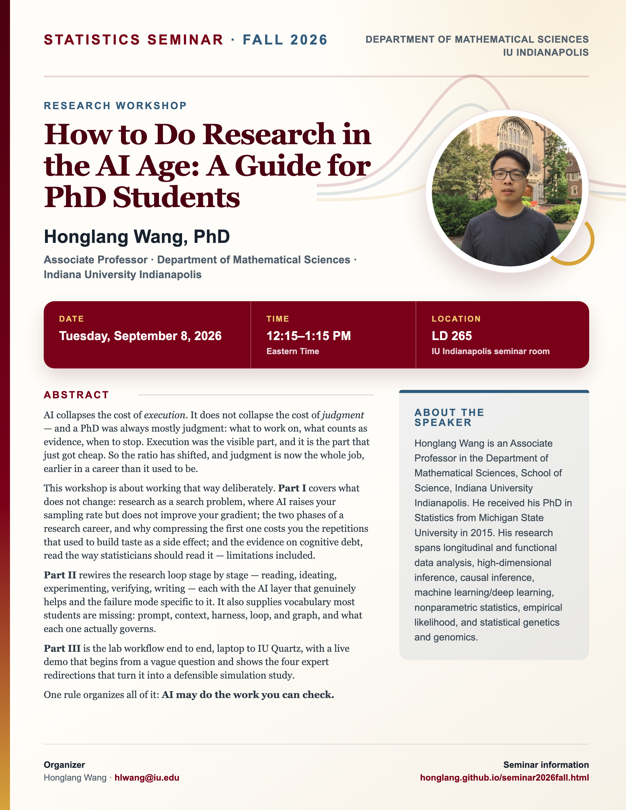

## Statistics Seminar: Fall 2026

**Speaker**: Honglang Wang, Associate Professor, Department of Mathematical Sciences, Indiana University Indianapolis

**Talk time**: Tuesday, September 8, 2026, 12:15–1:15 PM Eastern Time

**Location**: Seminar room LD 265, IU Indianapolis

## Abstract

AI collapses the cost of *execution*. It does not collapse the cost of *judgment* — and a PhD was always mostly judgment: what to work on, what counts as evidence, when to stop. Execution was the visible part, and it is the part that just got cheap. So the ratio has shifted, and judgment is now the whole job, earlier in a career than it used to be.

This workshop is about working that way deliberately. **Part I** covers what does not change: research as a search problem, where AI raises your sampling rate but does not improve your gradient; the two phases of a research career, and why compressing the first one costs you the repetitions that used to build taste as a side effect; and the evidence on cognitive debt, read the way statisticians should read it — limitations included.

**Part II** rewires the research loop stage by stage — reading, ideating, experimenting, verifying, writing — each with the AI layer that genuinely helps and the failure mode specific to it. It also supplies vocabulary most students are missing: prompt, context, harness, loop, and graph, and what each one actually governs.

**Part III** is the lab workflow end to end, laptop to IU Quartz, with a live demo that begins from a vague question and shows the four expert redirections that turn it into a defensible simulation study.

One rule organizes all of it: **AI may do the work you can check.**

## About the Speaker

Honglang Wang is an Associate Professor in the Department of Mathematical Sciences, School of Science, Indiana University Indianapolis. He received his PhD in Statistics from Michigan State University in 2015. His research spans longitudinal and functional data analysis, high-dimensional inference, causal inference, machine learning/deep learning, nonparametric statistics, empirical likelihood, and statistical genetics and genomics.

[View the seminar flyer and full event page](/seminars/HonglangWang/index.qmd).

<!--Include social share buttons-->


