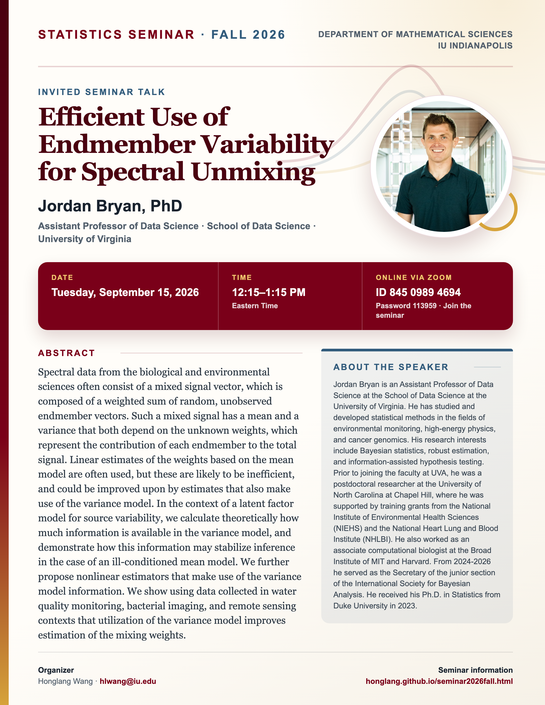

## Statistics Seminar: Fall 2026

**Speaker**: Jordan Bryan, Assistant Professor of Data Science, School of Data Science, University of Virginia

**Talk time**: Tuesday, September 15, 2026, 12:15–1:15 PM Eastern Time

**Online via Zoom**: Join from a computer or mobile device using [Zoom](https://iu.zoom.us/j/84509894694?pwd=K1F1c3JickhKREgwd3luellRVVpSUT09), or use Meeting ID **845 0989 4694** with Password **113959**.

## Abstract

Spectral data from the biological and environmental sciences often consist of a mixed signal vector, which is composed of a weighted sum of random, unobserved endmember vectors. Such a mixed signal has a mean and a variance that both depend on the unknown weights, which represent the contribution of each endmember to the total signal. Linear estimates of the weights based on the mean model are often used, but these are likely to be inefficient, and could be improved upon by estimates that also make use of the variance model. In the context of a latent factor model for source variability, we calculate theoretically how much information is available in the variance model, and demonstrate how this information may stabilize inference in the case of an ill-conditioned mean model. We further propose nonlinear estimators that make use of the variance model information. We show using data collected in water quality monitoring, bacterial imaging, and remote sensing contexts that utilization of the variance model improves estimation of the mixing weights.

## About the Speaker

Jordan Bryan is an Assistant Professor of Data Science at the School of Data Science at the University of Virginia. He has studied and developed statistical methods in the fields of environmental monitoring, high-energy physics, and cancer genomics. His research interests include Bayesian statistics, robust estimation, and information-assisted hypothesis testing.

Prior to joining the faculty at UVA, he was a postdoctoral researcher at the University of North Carolina at Chapel Hill, where he was supported by training grants from the National Institute of Environmental Health Sciences (NIEHS) and the National Heart Lung and Blood Institute (NHLBI). He also worked as an associate computational biologist at the Broad Institute of MIT and Harvard. From 2024-2026 he served as the Secretary of the junior section of the International Society for Bayesian Analysis. He received his Ph.D. in Statistics from Duke University in 2023.

[View the seminar flyer and full event page](/seminars/JordanBryan/index.qmd).

<!--Include social share buttons-->


