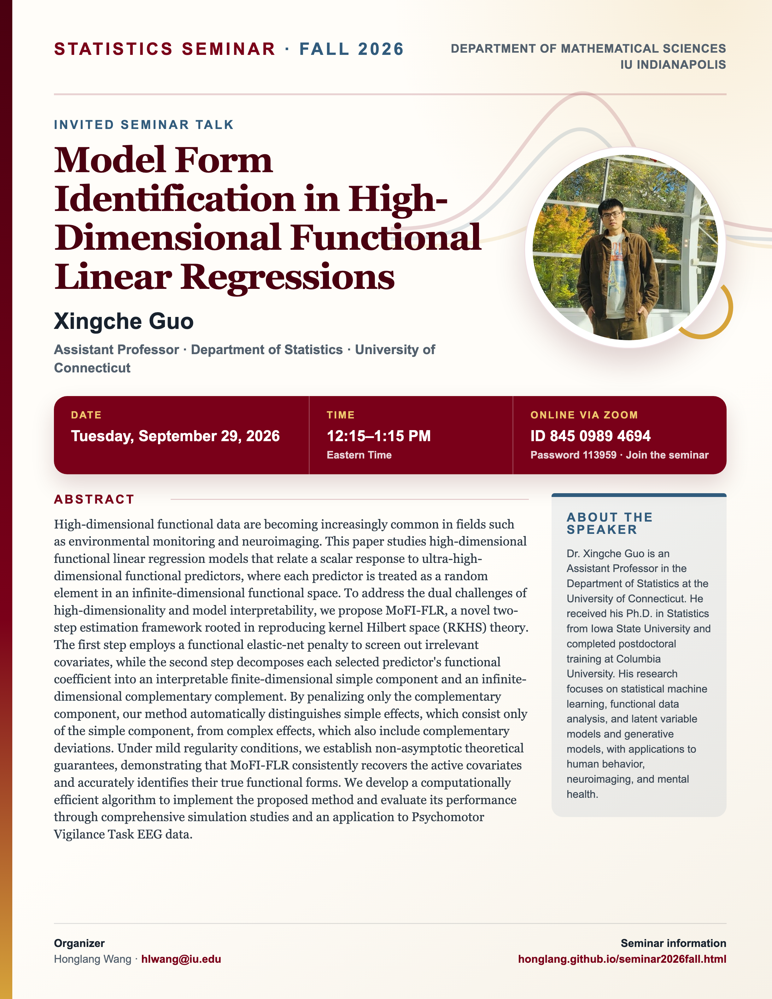

## Statistics Seminar: Fall 2026

**Speaker**: Xingche Guo, Assistant Professor, Department of Statistics, University of Connecticut

**Talk time**: Tuesday, September 29, 2026, 12:15–1:15 PM Eastern Time

**Online via Zoom**: Join from a computer or mobile device using [Zoom](https://iu.zoom.us/j/84509894694?pwd=K1F1c3JickhKREgwd3luellRVVpSUT09), or use Meeting ID **845 0989 4694** with Password **113959**.

## Abstract

High-dimensional functional data are becoming increasingly common in fields such as environmental monitoring and neuroimaging. This paper studies high-dimensional functional linear regression models that relate a scalar response to ultra-high-dimensional functional predictors, where each predictor is treated as a random element in an infinite-dimensional functional space. To address the dual challenges of high-dimensionality and model interpretability, we propose MoFI-FLR, a novel two-step estimation framework rooted in reproducing kernel Hilbert space (RKHS) theory. The first step employs a functional elastic-net penalty to screen out irrelevant covariates, while the second step decomposes each selected predictor's functional coefficient into an interpretable finite-dimensional simple component and an infinite-dimensional complementary complement. By penalizing only the complementary component, our method automatically distinguishes simple effects, which consist only of the simple component, from complex effects, which also include complementary deviations. Under mild regularity conditions, we establish non-asymptotic theoretical guarantees, demonstrating that MoFI-FLR consistently recovers the active covariates and accurately identifies their true functional forms. We develop a computationally efficient algorithm to implement the proposed method and evaluate its performance through comprehensive simulation studies and an application to Psychomotor Vigilance Task EEG data.

## About the Speaker

Dr. Xingche Guo is an Assistant Professor in the Department of Statistics at the University of Connecticut. He received his Ph.D. in Statistics from Iowa State University and completed postdoctoral training at Columbia University. His research focuses on statistical machine learning, functional data analysis, and latent variable models and generative models, with applications to human behavior, neuroimaging, and mental health.

[View the seminar flyer and full event page](/seminars/XingcheGuo/index.qmd).

<!--Include social share buttons-->


