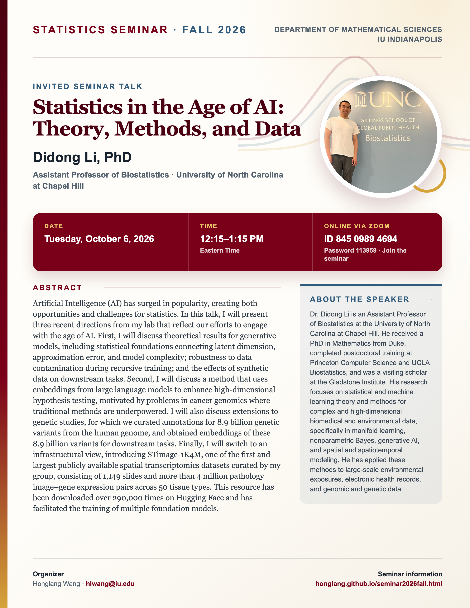

## Statistics Seminar: Fall 2026

**Speaker**: Didong Li, Assistant Professor of Biostatistics, University of North Carolina at Chapel Hill

**Talk time**: Tuesday, October 6, 2026, 12:15–1:15 PM Eastern Time

**Online via Zoom**: Join from a computer or mobile device using [Zoom](https://iu.zoom.us/j/84509894694?pwd=K1F1c3JickhKREgwd3luellRVVpSUT09), or use Meeting ID **845 0989 4694** with Password **113959**.

## Abstract

Artificial Intelligence (AI) has surged in popularity, creating both opportunities and challenges for statistics. In this talk, I will present three recent directions from my lab that reflect our efforts to engage with the age of AI. First, I will discuss theoretical results for generative models, including statistical foundations connecting latent dimension, approximation error, and model complexity; robustness to data contamination during recursive training; and the effects of synthetic data on downstream tasks. Second, I will discuss a method that uses embeddings from large language models to enhance high-dimensional hypothesis testing, motivated by problems in cancer genomics where traditional methods are underpowered. I will also discuss extensions to genetic studies, for which we curated annotations for 8.9 billion genetic variants from the human genome, and obtained embeddings of these 8.9 billion variants for downstream tasks. Finally, I will switch to an infrastructural view, introducing STimage-1K4M, one of the first and largest publicly available spatial transcriptomics datasets curated by my group, consisting of 1,149 slides and more than 4 million pathology image–gene expression pairs across 50 tissue types. This resource has been downloaded over 290,000 times on Hugging Face and has facilitated the training of multiple foundation models.

## About the Speaker

Dr. Didong Li is an Assistant Professor of Biostatistics at the University of North Carolina at Chapel Hill. He received a PhD in Mathematics from Duke, completed postdoctoral training at Princeton Computer Science and UCLA Biostatistics, and was a visiting scholar at the Gladstone Institute. His research focuses on statistical and machine learning theory and methods for complex and high-dimensional biomedical and environmental data, specifically in manifold learning, nonparametric Bayes, generative AI, and spatial and spatiotemporal modeling. He has applied these methods to large-scale environmental exposures, electronic health records, and genomic and genetic data.

[View the seminar flyer and full event page](/seminars/DidongLi/index.qmd).

<!--Include social share buttons-->


