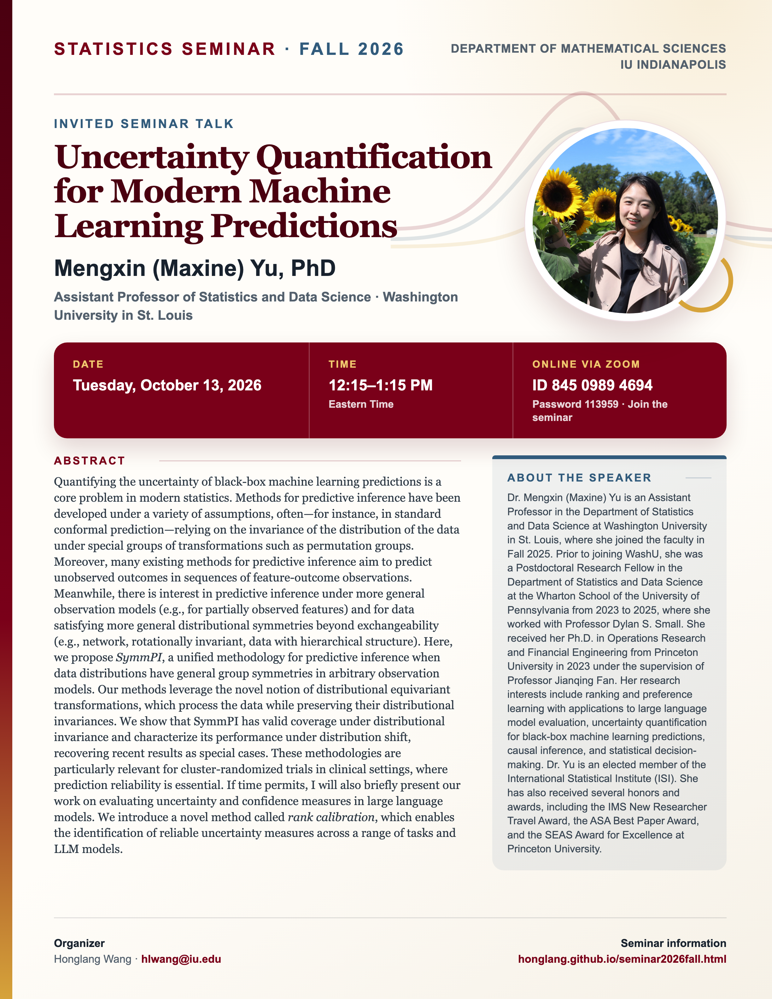

## Statistics Seminar: Fall 2026

**Speaker**: Mengxin (Maxine) Yu, Assistant Professor of Statistics and Data Science, Washington University in St. Louis

**Talk time**: Tuesday, October 13, 2026, 12:15–1:15 PM Eastern Time

**Online via Zoom**: Join from a computer or mobile device using [Zoom](https://iu.zoom.us/j/84509894694?pwd=K1F1c3JickhKREgwd3luellRVVpSUT09), or use Meeting ID **845 0989 4694** with Password **113959**.

## Abstract

Quantifying the uncertainty of black-box machine learning predictions is a core problem in modern statistics. Methods for predictive inference have been developed under a variety of assumptions, often—for instance, in standard conformal prediction—relying on the invariance of the distribution of the data under special groups of transformations such as permutation groups. Moreover, many existing methods for predictive inference aim to predict unobserved outcomes in sequences of feature-outcome observations. Meanwhile, there is interest in predictive inference under more general observation models (e.g., for partially observed features) and for data satisfying more general distributional symmetries beyond exchangeability (e.g., network, rotationally invariant, data with hierarchical structure). Here, we propose *SymmPI*, a unified methodology for predictive inference when data distributions have general group symmetries in arbitrary observation models. Our methods leverage the novel notion of distributional equivariant transformations, which process the data while preserving their distributional invariances. We show that SymmPI has valid coverage under distributional invariance and characterize its performance under distribution shift, recovering recent results as special cases. These methodologies are particularly relevant for cluster-randomized trials in clinical settings, where prediction reliability is essential.

If time permits, I will also briefly present our work on evaluating uncertainty and confidence measures in large language models. We introduce a novel method called *rank calibration*, which enables the identification of reliable uncertainty measures across a range of tasks and LLM models.

## About the Speaker

Dr. Mengxin (Maxine) Yu is an Assistant Professor in the Department of Statistics and Data Science at Washington University in St. Louis, where she joined the faculty in Fall 2025. Prior to joining WashU, she was a Postdoctoral Research Fellow in the Department of Statistics and Data Science at the Wharton School of the University of Pennsylvania from 2023 to 2025, where she worked with Professor Dylan S. Small. She received her Ph.D. in Operations Research and Financial Engineering from Princeton University in 2023 under the supervision of Professor Jianqing Fan.

Her research interests include ranking and preference learning with applications to large language model evaluation, uncertainty quantification for black-box machine learning predictions, causal inference, and statistical decision-making. Dr. Yu is an elected member of the International Statistical Institute (ISI). She has also received several honors and awards, including the IMS New Researcher Travel Award, the ASA Best Paper Award, and the SEAS Award for Excellence at Princeton University.

[View the seminar flyer and full event page](/seminars/MaxineYu/index.qmd).

<!--Include social share buttons-->


