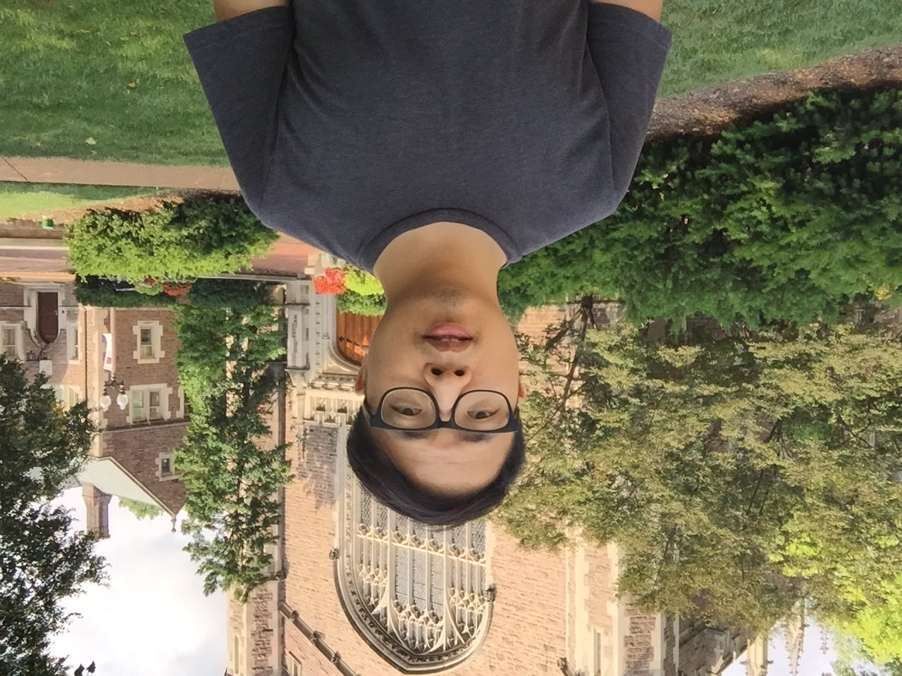

<style>
:root {
  --crimson: #7a0019;
  --crimson-deep: #4a0010;
  --ink: #18222e;
  --muted: #53606d;
  --cream: #f6f1e7;
  --paper: #fffdf9;
  --gold: #d6a33a;
  --blue: #315b7c;
}

* {
  box-sizing: border-box;
}

html,
body {
  margin: 0;
  padding: 0;
  background: #dedbd4;
}

body {
  color: var(--ink);
  font-family: Arial, Helvetica, sans-serif;
}

main.content,
#quarto-document-content {
  margin: 0 !important;
  padding: 0 !important;
  max-width: none !important;
}

.flyer {
  position: relative;
  width: 816px;
  height: 1056px;
  margin: 0 auto;
  overflow: hidden;
  background:
    radial-gradient(circle at 92% 0%, rgba(214, 163, 58, 0.17), transparent 26%),
    linear-gradient(145deg, var(--paper) 0%, #fffdf9 58%, var(--cream) 100%);
  box-shadow: 0 20px 55px rgba(24, 34, 46, 0.18);
}

.flyer::before {
  position: absolute;
  inset: 0 auto 0 0;
  width: 13px;
  background: linear-gradient(180deg, var(--crimson-deep), var(--crimson) 62%, var(--gold));
  content: "";
}

.density-lines {
  position: absolute;
  top: -8px;
  right: -62px;
  width: 465px;
  height: 285px;
  opacity: 0.15;
  pointer-events: none;
}

.flyer-inner {
  position: relative;
  z-index: 1;
  display: flex;
  flex-direction: column;
  height: 100%;
  padding: 42px 48px 34px 57px;
}

.masthead {
  display: flex;
  align-items: flex-start;
  justify-content: space-between;
  gap: 24px;
  padding-bottom: 22px;
  border-bottom: 2px solid rgba(122, 0, 25, 0.17);
}

.series-name {
  margin: 0;
  color: var(--crimson);
  font-size: 18px;
  font-weight: 800;
  letter-spacing: 0.14em;
  line-height: 1.1;
  text-transform: uppercase;
}

.series-term {
  color: var(--blue);
}

.host {
  max-width: 300px;
  margin: 1px 0 0;
  color: var(--muted);
  font-size: 12.5px;
  font-weight: 700;
  letter-spacing: 0.035em;
  line-height: 1.35;
  text-align: right;
  text-transform: uppercase;
}

.hero {
  display: grid;
  grid-template-columns: minmax(0, 1fr) 214px;
  gap: 31px;
  align-items: center;
  padding: 30px 0 25px;
}

.eyebrow {
  margin: 0 0 9px;
  color: var(--blue);
  font-size: 13px;
  font-weight: 800;
  letter-spacing: 0.15em;
  text-transform: uppercase;
}

.talk-title {
  max-width: 480px;
  margin: 0;
  color: var(--crimson-deep);
  font-family: Georgia, "Times New Roman", serif;
  font-size: 38px;
  font-weight: 700;
  letter-spacing: -0.025em;
  line-height: 1.08;
}

.speaker {
  margin: 17px 0 0;
  color: var(--ink);
  font-size: 24px;
  font-weight: 800;
  line-height: 1.15;
}

.speaker-affiliation {
  max-width: 450px;
  margin: 7px 0 0;
  color: var(--muted);
  font-size: 14px;
  font-weight: 600;
  line-height: 1.38;
}

.portrait-frame {
  position: relative;
  margin: 0;
  padding: 8px;
  background: #ffffff;
  border: 1px solid rgba(122, 0, 25, 0.13);
  border-radius: 50% 50% 48% 52% / 51% 48% 52% 49%;
  box-shadow: 0 15px 32px rgba(74, 0, 16, 0.18);
}

.portrait-frame::after {
  position: absolute;
  right: -8px;
  bottom: 9px;
  width: 58px;
  height: 58px;
  border: 5px solid var(--gold);
  border-top-color: transparent;
  border-left-color: transparent;
  border-radius: 50%;
  content: "";
}

.portrait-frame img {
  display: block;
  width: 100%;
  aspect-ratio: 1;
  object-fit: cover;
  border-radius: inherit;
}

.event-panel {
  display: grid;
  grid-template-columns: 1.25fr 1fr 1.05fr;
  background: var(--crimson);
  color: #ffffff;
  border-radius: 14px;
  box-shadow: 0 11px 24px rgba(74, 0, 16, 0.16);
}

.event-item {
  min-height: 86px;
  padding: 17px 20px 15px;
}

.event-item + .event-item {
  border-left: 1px solid rgba(255, 255, 255, 0.25);
}

.event-label {
  display: block;
  margin-bottom: 6px;
  color: #f0c86e;
  font-size: 10.5px;
  font-weight: 800;
  letter-spacing: 0.13em;
  text-transform: uppercase;
}

.event-value {
  display: block;
  color: #ffffff;
  font-size: 16px;
  font-weight: 750;
  line-height: 1.25;
}

.event-detail {
  display: block;
  margin-top: 3px;
  color: rgba(255, 255, 255, 0.83);
  font-size: 11px;
  font-weight: 600;
  line-height: 1.28;
}

.event-detail a {
  color: inherit;
  text-decoration: none;
}

.content-grid {
  display: grid;
  grid-template-columns: 1.65fr 0.95fr;
  gap: 33px;
  align-items: start;
  padding: 28px 0 14px;
}

.section-heading {
  display: flex;
  align-items: center;
  gap: 10px;
  margin: 0 0 11px;
  color: var(--crimson);
  font-size: 13px;
  font-weight: 850;
  letter-spacing: 0.14em;
  line-height: 1;
  text-transform: uppercase;
}

.section-heading::after {
  flex: 1;
  height: 1px;
  background: rgba(122, 0, 25, 0.2);
  content: "";
}

.abstract p {
  margin: 0;
  color: #2d3945;
  font-family: Georgia, "Times New Roman", serif;
  font-size: 12.7px;
  line-height: 1.38;
}

.abstract p + p {
  margin-top: 8px;
}

.bio {
  padding: 19px 20px 20px;
  background: rgba(49, 91, 124, 0.08);
  border-top: 4px solid var(--blue);
  border-radius: 3px 3px 12px 12px;
}

.bio .section-heading {
  color: var(--blue);
}

.bio .section-heading::after {
  background: rgba(49, 91, 124, 0.23);
}

.bio p {
  margin: 0;
  color: #394653;
  font-size: 12.8px;
  line-height: 1.52;
}

.footer {
  display: flex;
  justify-content: space-between;
  gap: 30px;
  align-items: flex-end;
  margin-top: auto;
  padding-top: 18px;
  border-top: 1px solid rgba(24, 34, 46, 0.13);
}

.organizer,
.seminar-link {
  margin: 0;
  color: var(--muted);
  font-size: 11.5px;
  line-height: 1.45;
}

.organizer strong,
.seminar-link strong {
  color: var(--ink);
}

.footer a {
  color: var(--crimson);
  font-weight: 700;
  text-decoration: none;
}

.seminar-link {
  text-align: right;
}

@media (max-width: 815px) {
  .flyer {
    width: 100vw;
    height: auto;
    min-height: 100vh;
  }

  .hero,
  .content-grid {
    grid-template-columns: 1fr;
  }

  .portrait-frame {
    width: 220px;
    grid-row: 1;
  }

  .event-panel {
    grid-template-columns: 1fr;
  }

  .event-item + .event-item {
    border-top: 1px solid rgba(255, 255, 255, 0.25);
    border-left: 0;
  }
}

@media print {
  @page {
    size: Letter portrait;
    margin: 0;
  }

  html,
  body {
    width: 8.5in;
    height: 11in;
    background: transparent;
  }

  .flyer {
    box-shadow: none;
  }
}
</style>

```{=html}
<div class="flyer" role="document" aria-label="Statistics seminar flyer for Honglang Wang">
  <svg class="density-lines" viewBox="0 0 470 285" aria-hidden="true">
    <path d="M0 251 C 82 252, 98 220, 150 151 C 191 97, 217 83, 257 158 C 294 225, 326 255, 470 255" fill="none" stroke="#7a0019" stroke-width="4"/>
    <path d="M0 262 C 72 262, 94 245, 129 207 C 164 168, 190 129, 221 151 C 249 171, 265 224, 303 244 C 336 261, 379 263, 470 263" fill="none" stroke="#315b7c" stroke-width="4"/>
    <path d="M0 270 C 115 270, 138 257, 177 231 C 218 204, 249 169, 284 187 C 315 203, 321 244, 357 260 C 384 272, 416 271, 470 271" fill="none" stroke="#d6a33a" stroke-width="4"/>
  </svg>

  <div class="flyer-inner">
    <header class="masthead">
      <p class="series-name">Statistics Seminar <span class="series-term">· Fall 2026</span></p>
      <p class="host">Department of Mathematical Sciences<br>IU Indianapolis</p>
    </header>

    <section class="hero" aria-labelledby="talk-title">
      <div>
        <p class="eyebrow">Research workshop</p>
        <h1 class="talk-title" id="talk-title">How to Do Research in the AI Age: A Guide for PhD Students</h1>
        <p class="speaker">Honglang Wang, PhD</p>
        <p class="speaker-affiliation">Associate Professor · Department of Mathematical Sciences · Indiana University Indianapolis</p>
      </div>

      <!-- Profile source: https://honglang.github.io/files/profile/honglangwang.JPG -->
      <figure class="portrait-frame">
        
      </figure>
    </section>

    <section class="event-panel" aria-label="Seminar date, time, and access details">
      <div class="event-item">
        <span class="event-label">Date</span>
        <span class="event-value">Tuesday, September 8, 2026</span>
      </div>
      <div class="event-item">
        <span class="event-label">Time</span>
        <span class="event-value">12:15–1:15 PM</span>
        <span class="event-detail">Eastern Time</span>
      </div>
      <div class="event-item">
        <span class="event-label">Location</span>
        <span class="event-value">LD 265</span>
        <span class="event-detail">IU Indianapolis seminar room</span>
      </div>
    </section>

    <div class="content-grid">
      <section class="abstract" aria-labelledby="abstract-heading">
        <h2 class="section-heading" id="abstract-heading">Abstract</h2>
        <p>AI collapses the cost of <em>execution</em>. It does not collapse the cost of <em>judgment</em> — and a PhD was always mostly judgment: what to work on, what counts as evidence, when to stop. Execution was the visible part, and it is the part that just got cheap. So the ratio has shifted, and judgment is now the whole job, earlier in a career than it used to be.</p>

        <p>This workshop is about working that way deliberately. <strong>Part I</strong> covers what does not change: research as a search problem, where AI raises your sampling rate but does not improve your gradient; the two phases of a research career, and why compressing the first one costs you the repetitions that used to build taste as a side effect; and the evidence on cognitive debt, read the way statisticians should read it — limitations included.</p>

        <p><strong>Part II</strong> rewires the research loop stage by stage — reading, ideating, experimenting, verifying, writing — each with the AI layer that genuinely helps and the failure mode specific to it. It also supplies vocabulary most students are missing: prompt, context, harness, loop, and graph, and what each one actually governs.</p>

        <p><strong>Part III</strong> is the lab workflow end to end, laptop to IU Quartz, with a live demo that begins from a vague question and shows the four expert redirections that turn it into a defensible simulation study.</p>

        <p>One rule organizes all of it: <strong>AI may do the work you can check.</strong></p>
      </section>

      <aside class="bio" aria-labelledby="bio-heading">
        <h2 class="section-heading" id="bio-heading">About the speaker</h2>
        <p>Honglang Wang is an Associate Professor in the Department of Mathematical Sciences, School of Science, Indiana University Indianapolis. He received his PhD in Statistics from Michigan State University in 2015. His research spans longitudinal and functional data analysis, high-dimensional inference, causal inference, machine learning/deep learning, nonparametric statistics, empirical likelihood, and statistical genetics and genomics.</p>
      </aside>
    </div>

    <footer class="footer">
      <p class="organizer"><strong>Organizer</strong><br>Honglang Wang · <a href="mailto:hlwang@iu.edu">hlwang@iu.edu</a></p>
      <p class="seminar-link"><strong>Seminar information</strong><br><a href="https://honglang.github.io/seminar2026fall.html">honglang.github.io/seminar2026fall.html</a></p>
    </footer>
  </div>
</div>
```
