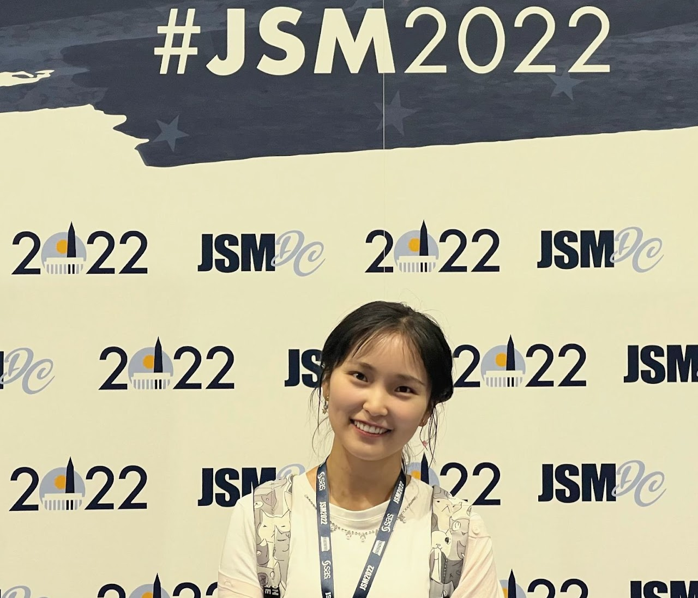

## Statistics Seminars: Spring 2026
## Department of Mathematical Sciences, IU Indianapolis

**Organizer**: Honglang Wang (hlwang at iu dot edu)

**Talk time**: 12:15-1:15pm (EST), 4/7/2026, Tuesday 

**Zoom Meetings**: We host our seminars via zoom meetings: Join from computer or mobile by clicking: [Zoom](https://iu.zoom.us/j/84509894694?pwd=K1F1c3JickhKREgwd3luellRVVpSUT09) to Join or use Meeting ID: 845 0989 4694 with Password: 113959 to join. 

**Title: Graphon Cross-Validation with Application to Drug Repurposing**

**Abstract**: Graphon, short for graph function, provides a generative model for networks. In recent decades, various methods for graphon estimation have been proposed. The success of most graphon estimation methods depends on the proper specification of hyperparameters. While some network cross-validation methods have been proposed, they suffer from restrictive model assumptions, expensive computational costs, and a lack of theoretical guarantees. To address these issues, we propose a graphon cross-validation (GraphonCV) method. The asymptotic properties of GraphonCV are established. The effectiveness of the proposed method in terms of both computation and accuracy is demonstrated through extensive simulation studies and real drug repurposing examples. 

**Bio**: Dr. [Huimin Cheng](https://sites.google.com/view/huimincheng/home) is an Assistant Professor in the Department of Biostatistics at Boston University. She was awarded the Rafik B. Hariri Junior Faculty Fellow in 2024. She received her Ph.D. in statistics from the University of Georgia in 2023. Her methodological research focuses on statistical network analysis, graph deep learning, causal inference, machine learning, and Riemannian geometry. 
 
Welcome to join us to learn more about Dr. Cheng's research work via [Zoom](https://iu.zoom.us/j/84509894694?pwd=K1F1c3JickhKREgwd3luellRVVpSUT09)!

<!-- ## [Journal Club Website](/langclub.qmd) -->

<!-- <https://www.baruch.cuny.edu/climateconference/> -->

<!--Include social share buttons-->


