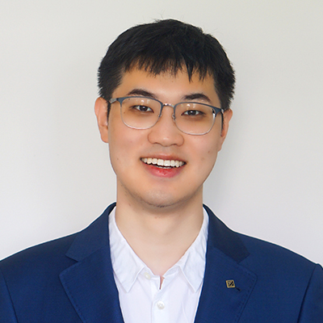

## Statistics Seminars: Spring 2026
## Department of Mathematical Sciences, IU Indianapolis

**Organizer**: Honglang Wang (hlwang at iu dot edu)

**Talk time**: 12:15-1:15pm (EST), 3/10/2026, Tuesday 

**Zoom Meetings**: We host our seminars via zoom meetings: Join from computer or mobile by clicking: [Zoom](https://iu.zoom.us/j/84509894694?pwd=K1F1c3JickhKREgwd3luellRVVpSUT09) to Join or use Meeting ID: 845 0989 4694 with Password: 113959 to join. 

**Title: Spatial Transcriptomics Across Scales: From Cohort Variation to Subcellular Organization**

**Abstract**: Spatial transcriptomics is transforming the study of complex tissues by enabling gene expression profiling within intact spatial context. As these technologies advance, they now support analysis across multiple biological scales, from cohort-level variation across individuals to subcellular RNA organization within single cells. In this talk, I will discuss computational methods for spatial transcriptomics across these scales, with a focus on three areas: cohort-scale variability, interpretation of relationships among spatial features, and analysis of subcellular-resolution spatial omics data. Together, these directions illustrate how spatial transcriptomics is evolving into a powerful framework for multi-scale tissue biology.

**Bio**: Dr. [Jian Hu](https://jianhu-lab.org/) is an Assistant Professor in the Department of Human Genetics, with a joint appointment in the Department of Biostatistics and Bioinformatics at Emory University. He is also a member of Emory’s AI.Humanity initiative. His research develops statistical and computational methods for spatial transcriptomics, single-cell genomics, and other multi-omics data, with applications to biological and clinical studies. He received his PhD in Biostatistics from the University of Pennsylvania. Lab: jianhu-lab.org
 
Welcome to join us to learn more about Dr. Hu's research work via [Zoom](https://iu.zoom.us/j/84509894694?pwd=K1F1c3JickhKREgwd3luellRVVpSUT09)!

<!-- ## [Journal Club Website](/langclub.qmd) -->

<!-- <https://www.baruch.cuny.edu/climateconference/> -->

<!--Include social share buttons-->


