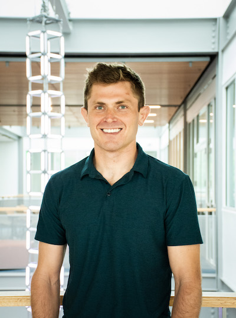

<style>
:root {
  --crimson: #7a0019;
  --crimson-deep: #4a0010;
  --ink: #18222e;
  --muted: #53606d;
  --cream: #f6f1e7;
  --paper: #fffdf9;
  --gold: #d6a33a;
  --blue: #315b7c;
}

* {
  box-sizing: border-box;
}

html,
body {
  margin: 0;
  padding: 0;
  background: #dedbd4;
}

body {
  color: var(--ink);
  font-family: Arial, Helvetica, sans-serif;
}

main.content,
#quarto-document-content {
  margin: 0 !important;
  padding: 0 !important;
  max-width: none !important;
}

.flyer {
  position: relative;
  width: 816px;
  height: 1056px;
  margin: 0 auto;
  overflow: hidden;
  background:
    radial-gradient(circle at 92% 0%, rgba(214, 163, 58, 0.17), transparent 26%),
    linear-gradient(145deg, var(--paper) 0%, #fffdf9 58%, var(--cream) 100%);
  box-shadow: 0 20px 55px rgba(24, 34, 46, 0.18);
}

.flyer::before {
  position: absolute;
  inset: 0 auto 0 0;
  width: 13px;
  background: linear-gradient(180deg, var(--crimson-deep), var(--crimson) 62%, var(--gold));
  content: "";
}

.density-lines {
  position: absolute;
  top: -8px;
  right: -62px;
  width: 465px;
  height: 285px;
  opacity: 0.15;
  pointer-events: none;
}

.flyer-inner {
  position: relative;
  z-index: 1;
  display: flex;
  flex-direction: column;
  height: 100%;
  padding: 42px 48px 34px 57px;
}

.masthead {
  display: flex;
  align-items: flex-start;
  justify-content: space-between;
  gap: 24px;
  padding-bottom: 22px;
  border-bottom: 2px solid rgba(122, 0, 25, 0.17);
}

.series-name {
  margin: 0;
  color: var(--crimson);
  font-size: 18px;
  font-weight: 800;
  letter-spacing: 0.14em;
  line-height: 1.1;
  text-transform: uppercase;
}

.series-term {
  color: var(--blue);
}

.host {
  max-width: 300px;
  margin: 1px 0 0;
  color: var(--muted);
  font-size: 12.5px;
  font-weight: 700;
  letter-spacing: 0.035em;
  line-height: 1.35;
  text-align: right;
  text-transform: uppercase;
}

.hero {
  display: grid;
  grid-template-columns: minmax(0, 1fr) 214px;
  gap: 31px;
  align-items: center;
  padding: 30px 0 25px;
}

.eyebrow {
  margin: 0 0 9px;
  color: var(--blue);
  font-size: 13px;
  font-weight: 800;
  letter-spacing: 0.15em;
  text-transform: uppercase;
}

.talk-title {
  max-width: 480px;
  margin: 0;
  color: var(--crimson-deep);
  font-family: Georgia, "Times New Roman", serif;
  font-size: 38px;
  font-weight: 700;
  letter-spacing: -0.025em;
  line-height: 1.08;
}

.speaker {
  margin: 17px 0 0;
  color: var(--ink);
  font-size: 24px;
  font-weight: 800;
  line-height: 1.15;
}

.speaker-affiliation {
  max-width: 450px;
  margin: 7px 0 0;
  color: var(--muted);
  font-size: 14px;
  font-weight: 600;
  line-height: 1.38;
}

.portrait-frame {
  position: relative;
  margin: 0;
  padding: 8px;
  background: #ffffff;
  border: 1px solid rgba(122, 0, 25, 0.13);
  border-radius: 50% 50% 48% 52% / 51% 48% 52% 49%;
  box-shadow: 0 15px 32px rgba(74, 0, 16, 0.18);
}

.portrait-frame::after {
  position: absolute;
  right: -8px;
  bottom: 9px;
  width: 58px;
  height: 58px;
  border: 5px solid var(--gold);
  border-top-color: transparent;
  border-left-color: transparent;
  border-radius: 50%;
  content: "";
}

.portrait-frame img {
  display: block;
  width: 100%;
  aspect-ratio: 1;
  object-fit: cover;
  border-radius: inherit;
}

.event-panel {
  display: grid;
  grid-template-columns: 1.25fr 1fr 1.05fr;
  background: var(--crimson);
  color: #ffffff;
  border-radius: 14px;
  box-shadow: 0 11px 24px rgba(74, 0, 16, 0.16);
}

.event-item {
  min-height: 86px;
  padding: 17px 20px 15px;
}

.event-item + .event-item {
  border-left: 1px solid rgba(255, 255, 255, 0.25);
}

.event-label {
  display: block;
  margin-bottom: 6px;
  color: #f0c86e;
  font-size: 10.5px;
  font-weight: 800;
  letter-spacing: 0.13em;
  text-transform: uppercase;
}

.event-value {
  display: block;
  color: #ffffff;
  font-size: 16px;
  font-weight: 750;
  line-height: 1.25;
}

.event-detail {
  display: block;
  margin-top: 3px;
  color: rgba(255, 255, 255, 0.83);
  font-size: 11px;
  font-weight: 600;
  line-height: 1.28;
}

.event-detail a {
  color: inherit;
  text-decoration: none;
}

.content-grid {
  display: grid;
  grid-template-columns: 1.45fr 1.05fr;
  gap: 28px;
  align-items: start;
  padding: 28px 0 14px;
}

.section-heading {
  display: flex;
  align-items: center;
  gap: 10px;
  margin: 0 0 11px;
  color: var(--crimson);
  font-size: 13px;
  font-weight: 850;
  letter-spacing: 0.14em;
  line-height: 1;
  text-transform: uppercase;
}

.section-heading::after {
  flex: 1;
  height: 1px;
  background: rgba(122, 0, 25, 0.2);
  content: "";
}

.abstract p {
  margin: 0;
  color: #2d3945;
  font-family: Georgia, "Times New Roman", serif;
  font-size: 15.1px;
  line-height: 1.45;
}

.bio {
  padding: 17px 18px 18px;
  background: rgba(49, 91, 124, 0.08);
  border-top: 4px solid var(--blue);
  border-radius: 3px 3px 12px 12px;
}

.bio .section-heading {
  color: var(--blue);
}

.bio .section-heading::after {
  background: rgba(49, 91, 124, 0.23);
}

.bio p {
  margin: 0;
  color: #394653;
  font-size: 11.6px;
  line-height: 1.43;
}

.footer {
  display: flex;
  justify-content: space-between;
  gap: 30px;
  align-items: flex-end;
  margin-top: auto;
  padding-top: 18px;
  border-top: 1px solid rgba(24, 34, 46, 0.13);
}

.organizer,
.seminar-link {
  margin: 0;
  color: var(--muted);
  font-size: 11.5px;
  line-height: 1.45;
}

.organizer strong,
.seminar-link strong {
  color: var(--ink);
}

.footer a {
  color: var(--crimson);
  font-weight: 700;
  text-decoration: none;
}

.seminar-link {
  text-align: right;
}

@media (max-width: 815px) {
  .flyer {
    width: 100vw;
    height: auto;
    min-height: 100vh;
  }

  .hero,
  .content-grid {
    grid-template-columns: 1fr;
  }

  .portrait-frame {
    width: 220px;
    grid-row: 1;
  }

  .event-panel {
    grid-template-columns: 1fr;
  }

  .event-item + .event-item {
    border-top: 1px solid rgba(255, 255, 255, 0.25);
    border-left: 0;
  }
}

@media print {
  @page {
    size: Letter portrait;
    margin: 0;
  }

  html,
  body {
    width: 8.5in;
    height: 11in;
    background: transparent;
  }

  .flyer {
    box-shadow: none;
  }
}
</style>

```{=html}
<div class="flyer" role="document" aria-label="Statistics seminar flyer for Jordan Bryan">
  <svg class="density-lines" viewBox="0 0 470 285" aria-hidden="true">
    <path d="M0 251 C 82 252, 98 220, 150 151 C 191 97, 217 83, 257 158 C 294 225, 326 255, 470 255" fill="none" stroke="#7a0019" stroke-width="4"/>
    <path d="M0 262 C 72 262, 94 245, 129 207 C 164 168, 190 129, 221 151 C 249 171, 265 224, 303 244 C 336 261, 379 263, 470 263" fill="none" stroke="#315b7c" stroke-width="4"/>
    <path d="M0 270 C 115 270, 138 257, 177 231 C 218 204, 249 169, 284 187 C 315 203, 321 244, 357 260 C 384 272, 416 271, 470 271" fill="none" stroke="#d6a33a" stroke-width="4"/>
  </svg>

  <div class="flyer-inner">
    <header class="masthead">
      <p class="series-name">Statistics Seminar <span class="series-term">· Fall 2026</span></p>
      <p class="host">Department of Mathematical Sciences<br>IU Indianapolis</p>
    </header>

    <section class="hero" aria-labelledby="talk-title">
      <div>
        <p class="eyebrow">Invited seminar talk</p>
        <h1 class="talk-title" id="talk-title">Efficient Use of Endmember Variability for Spectral Unmixing</h1>
        <p class="speaker">Jordan Bryan, PhD</p>
        <p class="speaker-affiliation">Assistant Professor of Data Science · School of Data Science · University of Virginia</p>
      </div>

      <!-- Profile source: https://j-g-b.github.io/assets/img/2025-Jordan-Bryan-1.jpg -->
      <figure class="portrait-frame">
        
      </figure>
    </section>

    <section class="event-panel" aria-label="Seminar date, time, and access details">
      <div class="event-item">
        <span class="event-label">Date</span>
        <span class="event-value">Tuesday, September 15, 2026</span>
      </div>
      <div class="event-item">
        <span class="event-label">Time</span>
        <span class="event-value">12:15–1:15 PM</span>
        <span class="event-detail">Eastern Time</span>
      </div>
      <div class="event-item">
        <span class="event-label">Online via Zoom</span>
        <span class="event-value">ID 845 0989 4694</span>
        <span class="event-detail">Password 113959 · <a href="https://iu.zoom.us/j/84509894694?pwd=K1F1c3JickhKREgwd3luellRVVpSUT09">Join the seminar</a></span>
      </div>
    </section>

    <div class="content-grid">
      <section class="abstract" aria-labelledby="abstract-heading">
        <h2 class="section-heading" id="abstract-heading">Abstract</h2>
        <p>Spectral data from the biological and environmental sciences often consist of a mixed signal vector, which is composed of a weighted sum of random, unobserved endmember vectors. Such a mixed signal has a mean and a variance that both depend on the unknown weights, which represent the contribution of each endmember to the total signal. Linear estimates of the weights based on the mean model are often used, but these are likely to be inefficient, and could be improved upon by estimates that also make use of the variance model. In the context of a latent factor model for source variability, we calculate theoretically how much information is available in the variance model, and demonstrate how this information may stabilize inference in the case of an ill-conditioned mean model. We further propose nonlinear estimators that make use of the variance model information. We show using data collected in water quality monitoring, bacterial imaging, and remote sensing contexts that utilization of the variance model improves estimation of the mixing weights.</p>
      </section>

      <aside class="bio" aria-labelledby="bio-heading">
        <h2 class="section-heading" id="bio-heading">About the speaker</h2>
        <p>Jordan Bryan is an Assistant Professor of Data Science at the School of Data Science at the University of Virginia. He has studied and developed statistical methods in the fields of environmental monitoring, high-energy physics, and cancer genomics. His research interests include Bayesian statistics, robust estimation, and information-assisted hypothesis testing.</p>

        <p>Prior to joining the faculty at UVA, he was a postdoctoral researcher at the University of North Carolina at Chapel Hill, where he was supported by training grants from the National Institute of Environmental Health Sciences (NIEHS) and the National Heart Lung and Blood Institute (NHLBI). He also worked as an associate computational biologist at the Broad Institute of MIT and Harvard. From 2024-2026 he served as the Secretary of the junior section of the International Society for Bayesian Analysis. He received his Ph.D. in Statistics from Duke University in 2023.</p>
      </aside>
    </div>

    <footer class="footer">
      <p class="organizer"><strong>Organizer</strong><br>Honglang Wang · <a href="mailto:hlwang@iu.edu">hlwang@iu.edu</a></p>
      <p class="seminar-link"><strong>Seminar information</strong><br><a href="https://honglang.github.io/seminar2026fall.html">honglang.github.io/seminar2026fall.html</a></p>
    </footer>
  </div>
</div>
```
